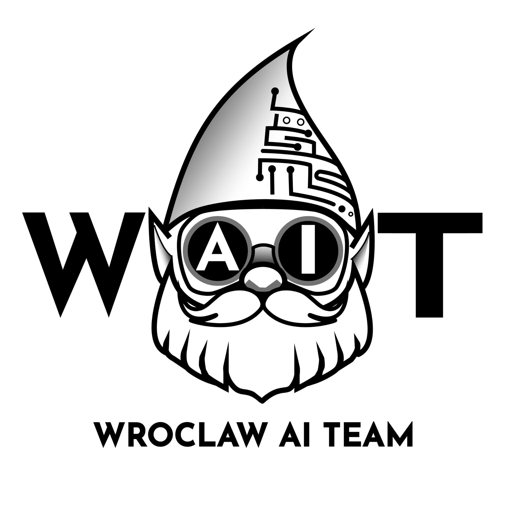
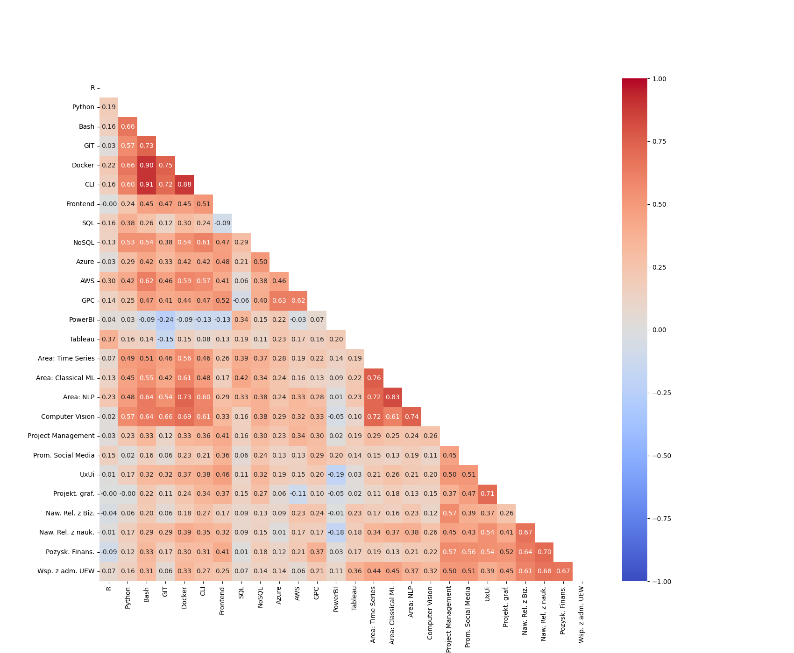
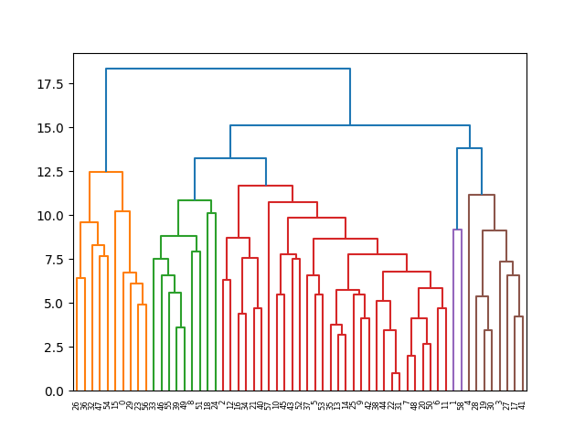

<h1 align="center" style="display: block; font-size: 2.5em; font-weight: bold; margin-block-start: 1em; margin-block-end: 1em;">
	
  
  <strong>Data Mining Advanced HR Analytics for WAIT </strong>  
</h1>

  
  

# 📝 Business context

The project focuses on optimizing human resources management in the [WAIT](https://github.com/wait-wro) team through advanced data analysis. WAIT, for which the project is being implemented, is an open non-profit organization bringing together individuals interested in AI, Data Science and BI issues. Currently, the organization has data on the declared competences of people ready to work in projects, but there is no knowledge about the actual level and development of these skills.

# 🎯A problem to solve

The project addresses the problem of ineffective allocation of resources in project management. The goal is to provide data-driven insights that will help improve project team composition through identifying the right people by dividing users into distinguishable groups (clusters).

The aim of the project is to understand the actual state and purpose of the skills of individual WAIT members - monitoring how they develop and whether they are being properly utilized in projects. By identifying characteristics that make certain members more suitable for specific projects, we aim to achieve the following benefits.

# 💡Benefits 

- [x] faster identification of suitable candidates for project roles,
- [x] better ability to quickly find replacement people when needed,
- [x] identification of weak points in WAIT, such as the lack of specialists in specific areas,
- [x] determination of possible directions for team training development,
- [x] reducing delays and improving project success rates,
- [x] identification of skill gaps within the team,
- [x] streamlining the recruitment process.

# 🤖 Machine Learning Method: Clustering 

To achieve the project goal, we will apply a machine learning technique known as **clustering**. It is a method used in exploratory data analysis that allows you to discover hidden structures in data without prior knowledge of labels or categories.

Based on user characteristics and their suitability for specific roles, we aim to achieve a clustered dataset in such a way that items in the same group (cluster) are more similar to each other than to items in other groups.

This method will allow us to identify patterns and relationships and segment people into distinct groups, which will facilitate better assignment to projects. 

# 🧩 Solution

## Data Acquisition

The data used in this project was collected through a survey conducted among members of the WAIT organization. The survey aimed to gather information about participation preferences in projects, the participants' skills in various fields, and their engagement with the community. Members of WAIT could choose the form of participation, including involvement in data projects, organizing community life, or consuming content. Additionally, questions covered technical skills, business skills, and areas of industry interest.

##  Kedro

For this project, we decided to use Kedro, an open-source platform for data workflow management that integrates with Python and facilitates building scalable data pipelines. By utilizing Kedro, we gained better control over data quality and improved our ability to manage complex data analysis processes. This tool allowed us to organize and manage code in a modular and easily scalable manner. Thanks to Kedro, we were able to effectively model the team members' competencies, conduct advanced analyses, and create precise user clusters, which directly contributed to better human resource allocation and optimization of project management within the WAIT organization.

> [!NOTE]
> Chart here will be updated in the future as the project develops.

## Data preprocessing
In the initial data preprocessing stage, several operations were carried out to improve the quality and usability of the collected information.

### 1. Handling missing values
Several survey responses contained missing values and were removed from further analysis to ensure data consistency.

### 2. Additional data processing
To enhance data analysis, three boolean columns were added to the data sheet, representing forms of participation: involvement in data projects, organizing community life, and consuming content. These columns take values of 1 (true) or 0 (false) based on the respondents' answers. Subsequently, filtering was conducted to retain only individuals interested in participating in data projects, discarding other records. The resulting table is presented below.

 | Value                                                               | Consumer | Organizer | Participant |
|---------------------------------------------------------------------|----------|-----------|-------------|
| I want to organize the "life" Community                             | 0        | 1        | 0           |
 | I want to participate in the data project                           | 0        | 0         | 1           |
 | I want to participate in the data project and organize the "life" Community | 0        | 1         | 1           |
  | For now, I want to draw, observe, "consume content"                 | 1        | 0         | 0           |

### 3. Removal of "business" columns
Eight columns related to "Industry Knowledge" were removed from the analysis because respondents misinterpreted these questions. Additionally, it was agreed that these columns would not be included in future surveys. Therefore, they were permanently removed from the data set.

### 4. Data transformation and standardization
Modifications were also made in the classification of respondents. Those who were uninterested and unaware were swapped places, allowing for more consistent groups in the dendrogram, thereby improving clustering results. Skill level schema is presented below.

| Level | Description                                    |
|-------|------------------------------------------------|
| 0     | Unaware - I have not heard of this             |
| 1     | Uninterested - I don't know, I prefer something else |
| 2     | Interested - I don't know, but I want to learn |
| 3     | Competent - I know/am interested               |
| 4     | Mentor - I know and want to help others        |

### 5. Skill scale adjustment
After consulting with the client, merging mentors with the "3" skill level group was rejected. This decision was based on recognizing the value of the declaration of willingness to teach others as a valuable distinction that deserves separate consideration. Therefore, distance scale adjustments were made to better reflect differences between skill level groups. This change aimed to provide more precise differentiation between groups with varying levels of expertise.

## Analysis

The data analysis process illustrates the pathway from the initial stage of generating a correlation matrix visualization, through deriving insights, to creating specific visualizations tailored to different stakeholder groups. Below is a description of the process, which encompasses a series of steps leading to valuable insights.

### Generating a correlation matrix visualization
The chart presents a correlation matrix that shows the relationships between various variables. Correlation values range from -1 to 1, where:
- 1 indicates a perfect positive correlation (variables increase or decrease together).
- -1 indicates a perfect negative correlation (one variable increases while the other decreases).
- 0 indicates no correlation.
  

## Clustering

The final result of the conducted analyses is the dendrogram presented below, which visualizes hierarchical clustering of the data. This involves iteratively combining the closest data points, thereby creating a hierarchy of clusters. The dendrogram illustrates this hierarchy in the form of a tree, where:

- the horizontal axis represents the IDs of WAIT organization members.
- the vertical axis represents the distance or diversity between clusters (the higher the level, the greater the diversity).
  

Clusters are marked with different colors, which makes it easier to identify the groups. The height on the vertical axis at which two points or clusters are joined indicates the level of similarity (a lower level means greater similarity).
# 🗝️ Findings

> [!NOTE]
> This paragraph will be updated in the future as the project develops.

# 👨‍💻 Team and Tools
The project is carried out by a three-person team of Master's students of Computer Science in Business as part of the Data Mining course:

`Adriana Kuczaj` - https://github.com/ada-kuczaj 
`Wojciech Maziarz` - https://github.com/Wojtini 
`Oleksii Karbovskyi` - https://github.com/Aleksey9777

In the project, we use the **Python** programming language and tools such as pandas and matplotlib libraries for cluster modeling.

# 📖 Additional sources of knowledge

- Morzy, T. (2013). Data mining. Warsaw: PWN Scientific Publishing House. ISBN 978-83-01-17175-9. Accessed: 19/05/2024. Available in Ibuk Libra: [link](https://libra.ibuk.pl/reader/exploracja-anych-tadeusz-morzy-63810)

- Walesiak, M. (2016). Generalized GDM distance measure in statistical multivariate analysis using the R program. Publishing House of the Wrocław University of Economics. ISBN: 978-83-7695-581-0. Available in Ibuk Libra: [link](https://www.ibuk.pl/fiszka/170477/uogolniona-miara-odleglosci-gdm-w-statystyczna-alizacja-wielowymiarowej-z-powiedzniem-programu-r.html)